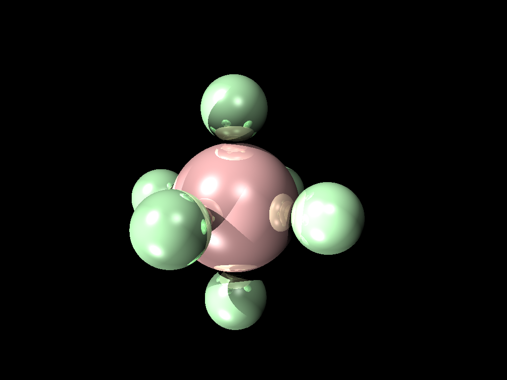

# rustracer



Offline rendering of 3D graphics using raytracing, written in Rust, and inspired by [Brown's CS1230](https://cs.brown.edu/courses/csci1230).

Written by [Stewart Morris](https://github.com/stew2003) & [Thomas Castleman](https://github.com/thomascastleman/).

## Usage

To build, run

```
cargo build --release
```

The binary can then be found at `target/release/rustracer`. Use the `--help` flag to get a full description of the command line interface.

## Documentation

To build the documentation and open it in your browser, run

```
cargo doc --open
```

## Sample Output

For examples of images produced by this program, see the [`output` directory](output).

## Scenefiles

The scenefiles are expected to be in the XML format used by CS1230. [Several examples can be found in this repository](https://github.com/BrownCSCI1230/scenefiles).
